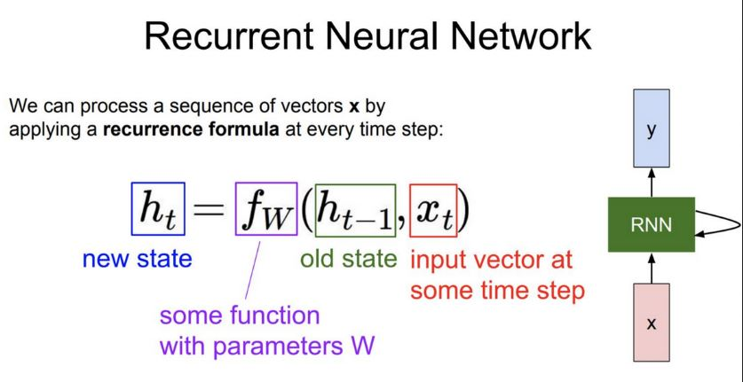

#### Session 4
***
## RNN & LSTM

Recurrent Neural Network ( Analyse sequence - sequence of alphabets, words, digital signals.. etc)
 - speech recognition ( more difficult ; need additional work to determine discrete words )
 - language translation
 - stock predictions
 - image annotation ( interesting )

RNN models are limited to **short term memory.** Because of backprop - > weight learning is poor 
in initial layers as at any layer learning happens for its own layer and for 1 layer before ( because presence of 
hidden input ) thus resulting in vaninsing gradient as we move backwards.

##### Modified RNN
 - LSTM ( Long Short memory )
 - GRU ( Gated Recurring Units )
 

***

### Convert RNN model to LSTM

RNN working model [RNN Colab](https://www.google.com "Google Colab")

### 1. Difference in Outputs

RNN :

>> output, hidden = self.rnn(embedded)

LSTM :

>> output, (hidden, cell) = self.lstm(embedded

