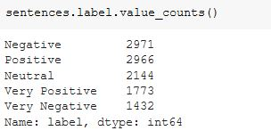
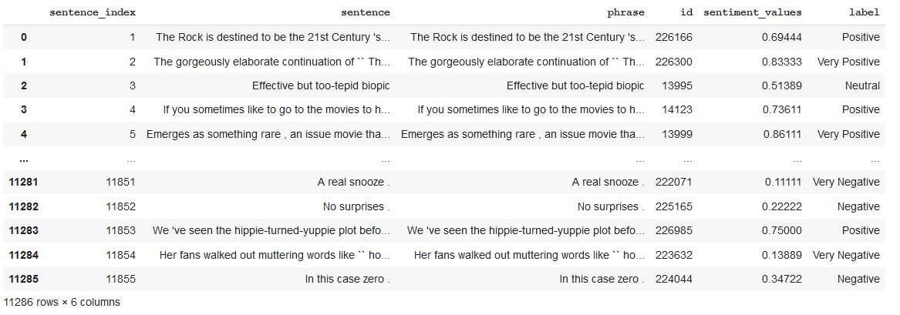
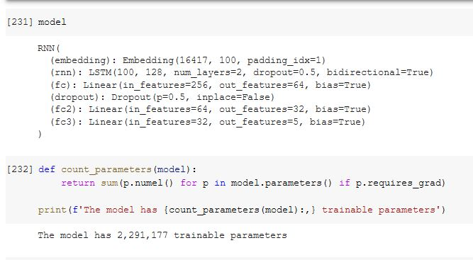
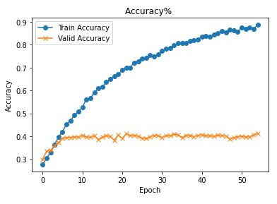
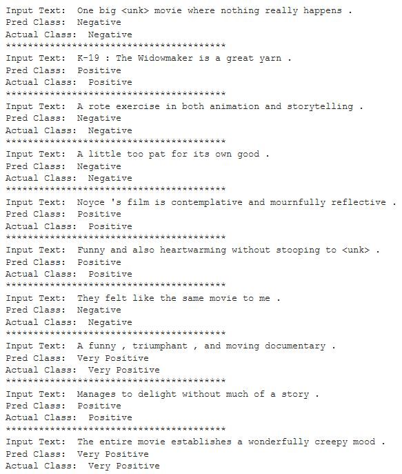
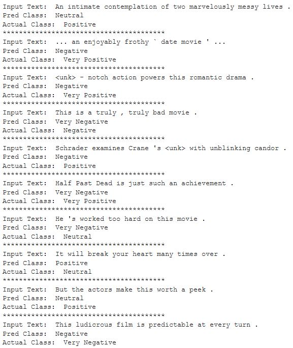
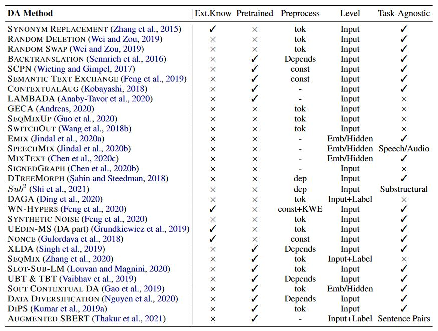

***
## 1. Simple Multiclass Classification ( Without Augmentation )

*[Solution Google Colab](https://colab.research.google.com/drive/1Tqv8AQff8OX4ozYksaQ1AqS26ZarBf-1?usp=sharing)*


### Data Pre-processing

Below file contains Text sentences Dataset ( 11286 rows )

```datasetSentences.txt to datasetSentences.txt```

Below file contains mapping from Sentences to its Phrases ( one to many )

```dictionary.txt to dictionary.txt```

Below file contains sentiment labels for Phrase (above dataset )

```sentiment_labels.txt to sentiment_labels.txt```

**Join Phrase and Labels file using LEFT JOIN** , lets call this data frame `mergedPhrases`
```
mergedPhrases = pd.merge(dictionary, sentiment_labels, on ='id')
mergedPhrases
```

**Join Sentence and mergedPhrases using LEFT JOIN**, lets call this data frame `sentences`
```
sentences = pd.merge(dataset, mergedPhrases, left_on='sentence', right_on='phrase')
```


**Function to convert into 5 class**

```
def createClass(a):
  if a <= 0.2 : 
    return 'Very Negative'
  elif a <=0.4 :
   return 'Negative'
  elif a <=0.6 :
   return 'Neutral'
  elif a <=0.8 :
   return 'Positive'
  else :
    return 'Very Positive'
```

Create Classes
```
sentiment_labels['label'] = sentiment_labels.sentiment_values.apply(createClass)
```

Class Distribution



Sample Dataset




Model and Number of Trainable Params




Training Logs

```
Epoch: 01 | Epoch Time: 0m 2s
	Train Loss: 1.568 | Train Acc: 27.62%
	 Val. Loss: 1.557 |  Val. Acc: 29.76%
Epoch: 02 | Epoch Time: 0m 2s
	Train Loss: 1.535 | Train Acc: 30.28%
	 Val. Loss: 1.519 |  Val. Acc: 33.39%
Epoch: 03 | Epoch Time: 0m 2s
	Train Loss: 1.497 | Train Acc: 32.93%
	 Val. Loss: 1.479 |  Val. Acc: 33.69%
Epoch: 04 | Epoch Time: 0m 2s
	Train Loss: 1.449 | Train Acc: 36.24%
	 Val. Loss: 1.458 |  Val. Acc: 35.89%
Epoch: 05 | Epoch Time: 0m 2s
	Train Loss: 1.385 | Train Acc: 39.66%
	 Val. Loss: 1.427 |  Val. Acc: 37.24%
Epoch: 06 | Epoch Time: 0m 2s
	Train Loss: 1.341 | Train Acc: 41.96%
	 Val. Loss: 1.418 |  Val. Acc: 38.99%
Epoch: 07 | Epoch Time: 0m 2s
	Train Loss: 1.280 | Train Acc: 45.31%
	 Val. Loss: 1.443 |  Val. Acc: 39.31%
Epoch: 08 | Epoch Time: 0m 2s
	Train Loss: 1.243 | Train Acc: 46.65%
	 Val. Loss: 1.443 |  Val. Acc: 39.45%
Epoch: 09 | Epoch Time: 0m 2s
	Train Loss: 1.190 | Train Acc: 49.24%
	 Val. Loss: 1.519 |  Val. Acc: 39.70%
Epoch: 10 | Epoch Time: 0m 2s
	Train Loss: 1.152 | Train Acc: 50.74%
	 Val. Loss: 1.485 |  Val. Acc: 39.51%
Epoch: 11 | Epoch Time: 0m 2s
	Train Loss: 1.102 | Train Acc: 52.69%
	 Val. Loss: 1.570 |  Val. Acc: 40.40%
Epoch: 12 | Epoch Time: 0m 2s
	Train Loss: 1.052 | Train Acc: 56.17%
	 Val. Loss: 1.542 |  Val. Acc: 39.59%
Epoch: 13 | Epoch Time: 0m 2s
	Train Loss: 1.029 | Train Acc: 56.52%
	 Val. Loss: 1.576 |  Val. Acc: 39.59%
Epoch: 14 | Epoch Time: 0m 2s
	Train Loss: 0.994 | Train Acc: 59.27%
	 Val. Loss: 1.605 |  Val. Acc: 40.15%
Epoch: 15 | Epoch Time: 0m 2s
	Train Loss: 0.956 | Train Acc: 60.90%
	 Val. Loss: 1.778 |  Val. Acc: 38.53%
Epoch: 16 | Epoch Time: 0m 2s
	Train Loss: 0.939 | Train Acc: 61.52%
	 Val. Loss: 1.712 |  Val. Acc: 39.66%
Epoch: 17 | Epoch Time: 0m 2s
	Train Loss: 0.885 | Train Acc: 63.64%
	 Val. Loss: 1.742 |  Val. Acc: 40.18%
Epoch: 18 | Epoch Time: 0m 2s
	Train Loss: 0.864 | Train Acc: 65.01%
	 Val. Loss: 1.884 |  Val. Acc: 39.81%
Epoch: 19 | Epoch Time: 0m 2s
	Train Loss: 0.832 | Train Acc: 66.24%
	 Val. Loss: 1.801 |  Val. Acc: 38.24%
Epoch: 20 | Epoch Time: 0m 2s
	Train Loss: 0.822 | Train Acc: 67.14%
	 Val. Loss: 1.796 |  Val. Acc: 40.45%
Epoch: 21 | Epoch Time: 0m 2s
	Train Loss: 0.783 | Train Acc: 68.97%
	 Val. Loss: 1.838 |  Val. Acc: 38.96%
Epoch: 22 | Epoch Time: 0m 2s
	Train Loss: 0.758 | Train Acc: 69.91%
	 Val. Loss: 2.001 |  Val. Acc: 41.06%
Epoch: 23 | Epoch Time: 0m 2s
	Train Loss: 0.746 | Train Acc: 70.02%
	 Val. Loss: 1.887 |  Val. Acc: 40.26%
Epoch: 24 | Epoch Time: 0m 2s
	Train Loss: 0.705 | Train Acc: 72.18%
	 Val. Loss: 2.067 |  Val. Acc: 40.27%
Epoch: 25 | Epoch Time: 0m 2s
	Train Loss: 0.698 | Train Acc: 72.68%
	 Val. Loss: 1.972 |  Val. Acc: 39.94%
Epoch: 26 | Epoch Time: 0m 2s
	Train Loss: 0.665 | Train Acc: 73.99%
	 Val. Loss: 2.050 |  Val. Acc: 39.13%
Epoch: 27 | Epoch Time: 0m 2s
	Train Loss: 0.662 | Train Acc: 74.27%
	 Val. Loss: 2.191 |  Val. Acc: 38.88%
Epoch: 28 | Epoch Time: 0m 2s
	Train Loss: 0.636 | Train Acc: 75.39%
	 Val. Loss: 2.211 |  Val. Acc: 39.76%
Epoch: 29 | Epoch Time: 0m 2s
	Train Loss: 0.634 | Train Acc: 74.99%
	 Val. Loss: 2.141 |  Val. Acc: 40.34%
Epoch: 30 | Epoch Time: 0m 2s
	Train Loss: 0.607 | Train Acc: 75.82%
	 Val. Loss: 2.118 |  Val. Acc: 40.14%
Epoch: 31 | Epoch Time: 0m 2s
	Train Loss: 0.575 | Train Acc: 77.33%
	 Val. Loss: 2.308 |  Val. Acc: 39.39%
Epoch: 32 | Epoch Time: 0m 2s
	Train Loss: 0.566 | Train Acc: 78.43%
	 Val. Loss: 2.258 |  Val. Acc: 40.32%
Epoch: 33 | Epoch Time: 0m 2s
	Train Loss: 0.550 | Train Acc: 78.73%
	 Val. Loss: 2.229 |  Val. Acc: 40.12%
Epoch: 34 | Epoch Time: 0m 2s
	Train Loss: 0.530 | Train Acc: 79.93%
	 Val. Loss: 2.445 |  Val. Acc: 40.92%
Epoch: 35 | Epoch Time: 0m 2s
	Train Loss: 0.515 | Train Acc: 80.63%
	 Val. Loss: 2.302 |  Val. Acc: 40.52%
Epoch: 36 | Epoch Time: 0m 2s
	Train Loss: 0.502 | Train Acc: 80.84%
	 Val. Loss: 2.554 |  Val. Acc: 39.31%
Epoch: 37 | Epoch Time: 0m 2s
	Train Loss: 0.500 | Train Acc: 80.90%
	 Val. Loss: 2.523 |  Val. Acc: 40.36%
Epoch: 38 | Epoch Time: 0m 2s
	Train Loss: 0.481 | Train Acc: 81.81%
	 Val. Loss: 2.556 |  Val. Acc: 40.22%
Epoch: 39 | Epoch Time: 0m 2s
	Train Loss: 0.464 | Train Acc: 82.08%
	 Val. Loss: 2.611 |  Val. Acc: 39.74%
Epoch: 40 | Epoch Time: 0m 2s
	Train Loss: 0.458 | Train Acc: 82.24%
	 Val. Loss: 2.398 |  Val. Acc: 40.30%
Epoch: 41 | Epoch Time: 0m 2s
	Train Loss: 0.446 | Train Acc: 83.52%
	 Val. Loss: 2.695 |  Val. Acc: 40.65%
Epoch: 42 | Epoch Time: 0m 2s
	Train Loss: 0.432 | Train Acc: 83.84%
	 Val. Loss: 2.480 |  Val. Acc: 40.15%
Epoch: 43 | Epoch Time: 0m 2s
	Train Loss: 0.429 | Train Acc: 83.54%
	 Val. Loss: 2.669 |  Val. Acc: 40.12%
Epoch: 44 | Epoch Time: 0m 2s
	Train Loss: 0.402 | Train Acc: 84.49%
	 Val. Loss: 2.738 |  Val. Acc: 39.91%
Epoch: 45 | Epoch Time: 0m 2s
	Train Loss: 0.403 | Train Acc: 85.13%
	 Val. Loss: 2.687 |  Val. Acc: 40.43%
Epoch: 46 | Epoch Time: 0m 2s
	Train Loss: 0.379 | Train Acc: 85.94%
	 Val. Loss: 2.687 |  Val. Acc: 40.18%
Epoch: 47 | Epoch Time: 0m 2s
	Train Loss: 0.394 | Train Acc: 85.45%
	 Val. Loss: 2.871 |  Val. Acc: 40.06%
Epoch: 48 | Epoch Time: 0m 2s
	Train Loss: 0.368 | Train Acc: 86.67%
	 Val. Loss: 2.585 |  Val. Acc: 38.81%
Epoch: 49 | Epoch Time: 0m 2s
	Train Loss: 0.369 | Train Acc: 86.30%
	 Val. Loss: 2.741 |  Val. Acc: 39.32%
Epoch: 50 | Epoch Time: 0m 2s
	Train Loss: 0.371 | Train Acc: 85.67%
	 Val. Loss: 2.809 |  Val. Acc: 39.78%
Epoch: 51 | Epoch Time: 0m 2s
	Train Loss: 0.351 | Train Acc: 87.51%
	 Val. Loss: 2.875 |  Val. Acc: 39.96%
Epoch: 52 | Epoch Time: 0m 2s
	Train Loss: 0.352 | Train Acc: 87.02%
	 Val. Loss: 2.770 |  Val. Acc: 39.56%
Epoch: 53 | Epoch Time: 0m 2s
	Train Loss: 0.337 | Train Acc: 87.65%
	 Val. Loss: 2.878 |  Val. Acc: 39.74%
Epoch: 54 | Epoch Time: 0m 2s
	Train Loss: 0.348 | Train Acc: 87.04%
	 Val. Loss: 2.762 |  Val. Acc: 40.57%
Epoch: 55 | Epoch Time: 0m 2s
	Train Loss: 0.305 | Train Acc: 88.71%
	 Val. Loss: 3.206 |  Val. Acc: 41.21%
```

### Accuracy

Overfitted on Train dataset



### Correctly Classified from Validation set


### Incorrectly Classified from Validation set


## 2. Data Augmentation Techniques

### Stanford Sentiment Analysis 

[Survey of Data Augmentation](https://arxiv.org/pdf/2105.03075.pdf)



