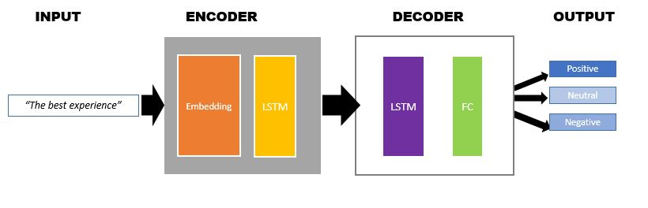

#### Session 6
***
## Simple Encoder & Decoder 

### Task

1. Encoder: an RNN/LSTM layer takes the words in a sentence one by one and finally converts them into a single vector. VERY IMPORTANT TO MAKE THIS SINGLE VECTOR

2. This single vector is then sent to another RNN/LSTM that also takes the last prediction as its second input. Then we take the final vector from this Cell.

3. And send this final vector to a Linear Layer and make the final prediction. 

This is how it should look:

	embedding

	word from a sentence +last hidden vector -> encoder -> single vector

	single vector + last hidden vector -> decoder -> single vector

	single vector -> FC layer -> Prediction

### Solution

Peek into Data set 

3 Class - ( 0 : Negative, 1 : Positive, 2 : Neutral )

#### High level Architecture

#### Tokenization

#### Encoder

class Encoder(nn.Module):
    
    # Define all the layers used in model
    def __init__(self, vocab_size, embedding_dim, hidden_dim, n_layers):
        super().__init__()          
        
        # Embedding layer
        self.embedding = nn.Embedding(vocab_size, embedding_dim)
        
        # LSTM layer
        self.encoder = nn.LSTM(embedding_dim, 
                           hidden_dim, 
                           num_layers=n_layers, 
                           #dropout=dropout,
                           batch_first=True)

    def forward(self, text, text_lengths):
        
        # text = [batch size, sent_length]
        embedded = self.embedding(text)
        # embedded = [batch size, sent_len, emb dim]
      
        # packed sequence
        packed_embedded = nn.utils.rnn.pack_padded_sequence(embedded, text_lengths.cpu(), batch_first=True)
        
        # pass to encoder
        packed_output, (hidden_encoder, cell_encoder) = self.encoder(packed_embedded)

        # unpack sequence
        encoder_output, encoder_output_lengths = nn.utils.rnn.pad_packed_sequence(packed_output, batch_first=True)
    
        # encoder o/p for decoder ; embedded for visualization purpose
        return encoder_output, embedded

**Total number of trainable params for Encoder class -**

#### Decoder

class Decoder(nn.Module):
    
    # Define all the layers used in model
    def __init__(self, vocab_size, encoder_output_dim, hidden_dim, output_dim, n_layers):
        
        super().__init__()          
        
        # LSTM layer
        self.decoder = nn.LSTM(encoder_output_dim, 
                           hidden_dim, 
                           num_layers=n_layers, 
                           batch_first=True)

        self.fc= nn.Linear(hidden_dim, output_dim)

    def forward(self, encoder_output):
        
        # pass to decoder
        output, (hidden_decoder, cell_decoder) = self.decoder(encoder_output)

        # Linear
        dense_outputs = self.fc(hidden_decoder)   

        final_output = F.softmax(dense_outputs[0], dim=1)

        # final_output is prediction & output is decoder output for visualization purpose
        return final_output, output
		
**Total number of trainable params for Decoder class -**

#### Optimizer

As we have two trainable objects - encoder and decoder, we would use 2 optimizers

#### Define optimizer and loss

encoder_optimizer = optim.Adam(encoder.parameters(), lr=2e-4)

decoder_optimizer = optim.Adam(decoder.parameters(), lr=2e-4)

> Can be improvised to use only one ( if encoder is instantiate inside the Decoder, need to check this )

**Remember** to make zero grad for both optimizers

### Train

def train(encoder, decoder, iterator, encoder_optimizer, decoder_optimizer, criterion):
    
    # initialize every epoch 
    epoch_loss = 0
    epoch_acc = 0
    
    # set the model in training phase
    encoder.train()  
    decoder.train()
    
    for batch in iterator:
        
        # resets the gradients after every batch
        encoder_optimizer.zero_grad()   
        decoder_optimizer.zero_grad()   
        
        # retrieve text and no. of words
        tweet, tweet_lengths = batch.tweet  
        
        # convert to 1D tensor
        encoder_out, embedding = encoder(tweet, tweet_lengths)
        
        predictions, decoder_out = decoder(encoder_out)
        predictions = predictions.squeeze() 

        # compute the loss
        loss = criterion(predictions, batch.label)        
        
        # compute the binary accuracy
        acc = binary_accuracy(predictions, batch.label)   
        
        # backpropage the loss and compute the gradients
        loss.backward()       
        
        # update the weights
        encoder_optimizer.step()
        decoder_optimizer.step()
        
        # loss and accuracy
        epoch_loss += loss.item()  
        epoch_acc += acc.item()    
        
    return epoch_loss / len(iterator), epoch_acc / len(iterator)
	

#### Training Logs

 

**Loss for train and validation**

 

**Accuracy for train and validation**

 

All the "Neutral" class (i.e. 2) records are not being predicted by model

 

### Explain and Classify Example Sentences

**Example 1 - *The best experience* (Predicted : Positive)**

 

**Example 2 - *Not best experience* (Predicted : Negative)**

By just replacing the first word **Not** by **The** from the example 1.

 

### Compare the Median, Mean and Std of Decoder LSTM outputs for both sentence

We find in first sentence **The** has **more positive** value than first word Not in second sentence 
which might have increased the influence on positive class along with last same word **experience**

 
