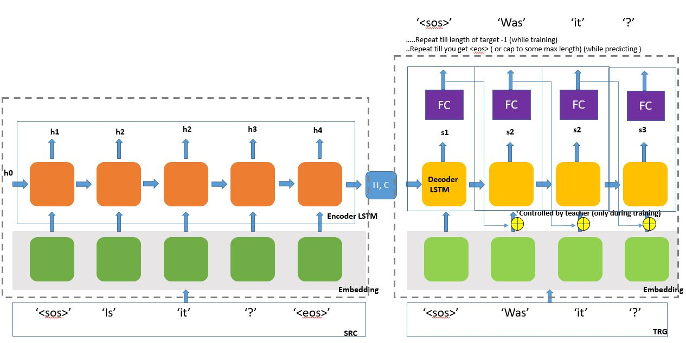
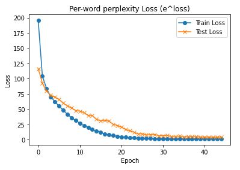
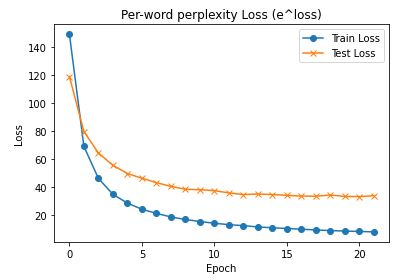

#### Session 7
***
## Simple Sequence to Sequence Modeling

### Task

Train Model on following datasets

1. http://www.cs.cmu.edu/~ark/QA-data/

A corpus of Wikipedia articles, manually-generated factoid questions from them, and 
manually-generated answers to these questions, for use in academic research.

#### [Solution link in Colab](https://colab.research.google.com/drive/1A5P8cz8B5vexEGhEZiHkYf96VBuClUUI?usp=sharing)

2. https://quoradata.quora.com/First-Quora-Dataset-Release-Question-Pairs

A set of Quora questions to determine whether pairs of question texts actually correspond 
to semantically equivalent queries. More than 400,000 lines of potential questions duplicate 
question pairs.

#### [Solution link in Colab](https://colab.research.google.com/drive/1Y1-dc6i_HgVyNvo5SYmW8rmlH6pbbL91?usp=sharing)

[Dataset source](https://kili-technology.com/blog/chatbot-training-datasets/)


### Data pre-processing

For any text dataset 

1. Tokenize the text : Convert sentence into list of tokens. **Tokens are not words** e.g. '!', "'s"

spaCy is mostly used package to convert sentence to tokens.

Below function takes in a sentence and gives out list of tokens.
```
def tokenize_en(text):
    """
    Tokenizes English text from a string into a list of strings (tokens)
    """
    return [tok.text for tok in spacy_en.tokenizer(text)]
```

2. Set Field from torchtext.legacy.data - basic proccessing for each record in text dataset. 
	
	a. Which tokenizer to use - here we using spacy,
	
	b. Calulating len of list - to be used for padding and sorting
	
	c. Convert all elements of list into lowercase 
	
	d. Prefix / Post fix  - to keep track of start ( initial token ) and end of sequence.

```	
SRC = Field(tokenize = tokenize_en,
            init_token = '<sos>', 
            eos_token = '<eos>', 
            lower = True,
            include_lengths=True)
			
```

3. Convert from list to torchtext dataset

```
example = [Example.fromlist([str(df.question1[i]), str(df.question2[i])], fields) for i in range(df.shape[0])]

quoraDataset = Dataset(example, fields)

```

4. Split into Train & Test

```
(train, test) = quoraDataset.split(split_ratio=[0.70, 0.30], random_state=random.seed(SEED))
```

5. Build the vocabulary - **Vocab should be build using train dataset** only. If we use test or
validation dataset, there will be possibility of data leaks.

min_freq used to retrict tokens occuring more than twice else map to <unk>.

```
SRC.build_vocab(train, min_freq = 2)
TRG.build_vocab(train, min_freq = 2)
```

6. Create an iterator 

```
BATCH_SIZE = 64

train_iterator, test_iterator = BucketIterator.splits(
    (train, test), 
    batch_size = BATCH_SIZE, 
    sort_key = lambda x: len(x.question1),
    sort_within_batch=True, 
    device = device)
```
	
7. Save the input text vocabulary to used for predictions from model

```
import os, pickle
with open(F"./gdrive/MyDrive/NLP/tokenizer.pkl", 'wb') as tokens:
  pickle.dump( SRC.vocab.stoi, tokens)
```  



### Understanding - Encoder

1. Takes in indexed SRC tokens

2. Does Embedding ( all senetences in batch at once )

3. Pass to LSTM 

4. Returns last Hidden & Cell state outputs (This makes the context vector)

Note : Dropout is applied between layers of multi-layer RNN 

### Understanding - Decoder

1. Takes in single indexed token at a time 

2. Unsqueeze to create a additional dimension (for batch)

3. Create embeddings

4. Pass to LSTM ( use hidden and cell state from ENCODER output to initialise here )

5. Pass the output from previous step 4 to linear FC layer


### Understanding - Seq2Seq Class

We create a additional class Seq2Seq which will help combine encoder and decoder, act as a wrapper.

NOTE : Make sure number of layers, hidden and cell states dimensions are same for both encoder and decoder.
Otherwise handle it with additional tricks ;)

1. Takes input sentences

2. Pass to encoder -> spits out last hidden & cell

3. First input decoder for each sentence is passed as <sos> token

4. Loop till length of target senetence minus 1 ( number of target tokens ) is reached.
Minus 1 because last token is always <eos> in target list of tokens and we do not have any outcome if this
is input to decoder.

	a. Pass input, previous hidden and cell state to decoder

	b. Take output, hidden and cell state from decoder and stack the output in list
	
	c. Use ```Teacher ratio (0 to 1): Random choice of cheating i.e. pass actual target truth or
	the previous output from decoder.```
	
	d. go to step a with chosen input (output from decoder or actual truth ), hidden and cell state. Repeat.
	


NOTE : HID_DIM and N_LAYERS are same for ENcoder and Decoder - easier to pass info.

```
enc = Encoder(INPUT_DIM, ENC_EMB_DIM, HID_DIM, N_LAYERS, ENC_DROPOUT)
dec = Decoder(OUTPUT_DIM, DEC_EMB_DIM, HID_DIM, N_LAYERS, DEC_DROPOUT)

model = Seq2Seq(enc, dec, device).to(device)
```

### Understanding - Loss

We have to remove paddings before we calculate loss, we do so by getting all padded index and pass it 
in CrossEntropyLoss specifying to ignore. 

```
TRG_PAD_IDX = TRG.vocab.stoi[TRG.pad_token]

criterion = nn.CrossEntropyLoss(ignore_index = TRG_PAD_IDX)
```

NOTE: Loss is calcuated using avg of token by token comparison.

[More on Optimizers](https://ruder.io/optimizing-gradient-descent/)

### Understanding - Train

1. Iterate and get a batch 
	
	a. Get SRC and TRG tokens for batch 
	
	b. Make the gradient zero
	
	c. Pass the SRC and TRG tokens to seq2seq model and get output
	
	d. Flatten the output
	
	e. Remove the first item from flattened output ( remember first input tojen was <sos> so it's 
	coresponding output would be 0 and we ignore so that it doesn't add to losses.
	
	f. Compute loss using backward prop
	
	g. ```Clip``` prevents gradient exploding
	
	```
	torch.nn.utils.clip_grad_norm_(model.parameters(), clip)
	```
	
	h. Add the loss
	
2. Return avg loss 

### Understanding - Evaluate

Similar to train except 

1. Use ```model.eval()``` : This prevents from using dropouts 

2. Use ```torch.no_grad()``` : We don't want to compute gradients for backprop

3. Do not use ```Teacher param``` : Turn off using 0

```
output = model(src, trg, 0)
```

### Prediction Function

```
def rephraseQuestion(ques, SRC, TRG, model, maxLength = 100):
  model.eval()

  # tokenize
  tokenized = [tok.text.lower() for tok in nlp.tokenizer(ques)] 
  #print('tokenized: ', tokenized)

  # add <sos> and add <eos>
  tokenized = ['<sos>'] + tokenized + ['<eos>']
  #print('tokenized: ', tokenized)

  # convert to integer sequence using predefined tokenizer dictionary
  indexed = [SRC.vocab.stoi[t] for t in tokenized]        
  #print('indexed: ', indexed)

  # compute no. of words        
  length = [len(indexed)]
  #print('length : ', length)

  # convert to tensor                                    
  tensor = torch.LongTensor(indexed).to(device)   
  #print('tensor shape: ', tensor.shape)

  # reshape in form of batch, no. of words           
  tensor = tensor.unsqueeze(1) 
  #print('tensor shape: ', tensor.shape)


  with torch.no_grad():
    hidden, cell = model.encoder(tensor)

  #first input to the decoder is the <sos> tokens
  trg_indexes = [TRG.vocab.stoi[TRG.init_token]]

  for t in range(1, maxLength):
      
      trg_tensor = torch.LongTensor([trg_indexes[-1]]).to(device)
      #insert input token embedding, previous hidden and previous cell states
      
	  #receive output tensor (predictions) and new hidden and cell states
      with torch.no_grad():
        output, hidden, cell = model.decoder(trg_tensor, hidden, cell)
            
      #get the highest predicted token from our predictions
      pred_token = output.argmax(1).item()
      #print(pred_token)


      trg_indexes.append(pred_token)

      if pred_token == TRG.vocab.stoi[TRG.eos_token]:
              break
      
  trg_tokens = [TRG.vocab.itos[i] for i in trg_indexes]
  words = trg_tokens[1:(len(trg_tokens)-1)]

  pred = ' '.join(words) 

  return pred
  
```

### Dataset - 1

[Data-1](http://www.cs.cmu.edu/~ark/QA-data/)

A corpus of Wikipedia articles, manually-generated factoid questions from them, and 
manually-generated answers to these questions, for use in academic research.

#### Training Logs

```
Epoch: 01 | Time: 0m 4s
	Train Loss: 5.276 | Train PPL: 195.494
	 Test Loss: 4.759 |   Test PPL: 116.601
Epoch: 02 | Time: 0m 3s
	Train Loss: 4.646 | Train PPL: 104.166
	 Test Loss: 4.530 |   Test PPL:  92.723
Epoch: 03 | Time: 0m 3s
	Train Loss: 4.430 | Train PPL:  83.937
	 Test Loss: 4.375 |   Test PPL:  79.449
Epoch: 04 | Time: 0m 3s
	Train Loss: 4.250 | Train PPL:  70.120
	 Test Loss: 4.290 |   Test PPL:  72.957
Epoch: 05 | Time: 0m 4s
	Train Loss: 4.135 | Train PPL:  62.467
	 Test Loss: 4.244 |   Test PPL:  69.699
Epoch: 06 | Time: 0m 3s
	Train Loss: 4.005 | Train PPL:  54.897
	 Test Loss: 4.191 |   Test PPL:  66.067
Epoch: 07 | Time: 0m 3s
	Train Loss: 3.881 | Train PPL:  48.481
	 Test Loss: 4.092 |   Test PPL:  59.861
Epoch: 08 | Time: 0m 3s
	Train Loss: 3.726 | Train PPL:  41.526
	 Test Loss: 4.016 |   Test PPL:  55.484
Epoch: 09 | Time: 0m 3s
	Train Loss: 3.583 | Train PPL:  35.968
	 Test Loss: 3.951 |   Test PPL:  51.994
Epoch: 10 | Time: 0m 3s
	Train Loss: 3.445 | Train PPL:  31.345
	 Test Loss: 3.863 |   Test PPL:  47.626
Epoch: 11 | Time: 0m 3s
	Train Loss: 3.299 | Train PPL:  27.087
	 Test Loss: 3.847 |   Test PPL:  46.835
Epoch: 12 | Time: 0m 3s
	Train Loss: 3.132 | Train PPL:  22.920
	 Test Loss: 3.787 |   Test PPL:  44.142
Epoch: 13 | Time: 0m 3s
	Train Loss: 3.001 | Train PPL:  20.112
	 Test Loss: 3.680 |   Test PPL:  39.637
Epoch: 14 | Time: 0m 3s
	Train Loss: 2.821 | Train PPL:  16.795
	 Test Loss: 3.671 |   Test PPL:  39.293
Epoch: 15 | Time: 0m 3s
	Train Loss: 2.645 | Train PPL:  14.077
	 Test Loss: 3.508 |   Test PPL:  33.383
Epoch: 16 | Time: 0m 3s
	Train Loss: 2.462 | Train PPL:  11.723
	 Test Loss: 3.430 |   Test PPL:  30.889
Epoch: 17 | Time: 0m 3s
	Train Loss: 2.201 | Train PPL:   9.034
	 Test Loss: 3.457 |   Test PPL:  31.736
Epoch: 18 | Time: 0m 3s
	Train Loss: 2.088 | Train PPL:   8.073
	 Test Loss: 3.409 |   Test PPL:  30.225
Epoch: 19 | Time: 0m 3s
	Train Loss: 1.910 | Train PPL:   6.753
	 Test Loss: 3.228 |   Test PPL:  25.232
Epoch: 20 | Time: 0m 3s
	Train Loss: 1.698 | Train PPL:   5.463
	 Test Loss: 3.145 |   Test PPL:  23.212
Epoch: 21 | Time: 0m 3s
	Train Loss: 1.477 | Train PPL:   4.379
	 Test Loss: 3.022 |   Test PPL:  20.527
Epoch: 22 | Time: 0m 3s
	Train Loss: 1.293 | Train PPL:   3.643
	 Test Loss: 2.807 |   Test PPL:  16.565
Epoch: 23 | Time: 0m 3s
	Train Loss: 1.152 | Train PPL:   3.163
	 Test Loss: 2.681 |   Test PPL:  14.593
Epoch: 24 | Time: 0m 3s
	Train Loss: 0.985 | Train PPL:   2.678
	 Test Loss: 2.506 |   Test PPL:  12.258
Epoch: 25 | Time: 0m 3s
	Train Loss: 0.855 | Train PPL:   2.351
	 Test Loss: 2.234 |   Test PPL:   9.333
Epoch: 26 | Time: 0m 3s
	Train Loss: 0.703 | Train PPL:   2.020
	 Test Loss: 2.250 |   Test PPL:   9.487
Epoch: 27 | Time: 0m 3s
	Train Loss: 0.662 | Train PPL:   1.938
	 Test Loss: 2.044 |   Test PPL:   7.724
Epoch: 28 | Time: 0m 3s
	Train Loss: 0.606 | Train PPL:   1.834
	 Test Loss: 2.119 |   Test PPL:   8.325
Epoch: 29 | Time: 0m 3s
	Train Loss: 0.491 | Train PPL:   1.634
	 Test Loss: 2.146 |   Test PPL:   8.547
Epoch: 30 | Time: 0m 3s
	Train Loss: 0.499 | Train PPL:   1.647
	 Test Loss: 1.847 |   Test PPL:   6.340
Epoch: 31 | Time: 0m 3s
	Train Loss: 0.468 | Train PPL:   1.596
	 Test Loss: 1.874 |   Test PPL:   6.512
Epoch: 32 | Time: 0m 3s
	Train Loss: 0.410 | Train PPL:   1.507
	 Test Loss: 1.907 |   Test PPL:   6.733
Epoch: 33 | Time: 0m 3s
	Train Loss: 0.393 | Train PPL:   1.481
	 Test Loss: 1.604 |   Test PPL:   4.971
Epoch: 34 | Time: 0m 3s
	Train Loss: 0.362 | Train PPL:   1.437
	 Test Loss: 1.687 |   Test PPL:   5.403
Epoch: 35 | Time: 0m 3s
	Train Loss: 0.356 | Train PPL:   1.428
	 Test Loss: 1.735 |   Test PPL:   5.670
Epoch: 36 | Time: 0m 3s
	Train Loss: 0.346 | Train PPL:   1.413
	 Test Loss: 1.509 |   Test PPL:   4.522
Epoch: 37 | Time: 0m 3s
	Train Loss: 0.302 | Train PPL:   1.353
	 Test Loss: 1.559 |   Test PPL:   4.755
Epoch: 38 | Time: 0m 3s
	Train Loss: 0.264 | Train PPL:   1.303
	 Test Loss: 1.553 |   Test PPL:   4.727
Epoch: 39 | Time: 0m 3s
	Train Loss: 0.271 | Train PPL:   1.311
	 Test Loss: 1.586 |   Test PPL:   4.883
Epoch: 40 | Time: 0m 3s
	Train Loss: 0.289 | Train PPL:   1.334
	 Test Loss: 1.392 |   Test PPL:   4.021
Epoch: 41 | Time: 0m 3s
	Train Loss: 0.302 | Train PPL:   1.352
	 Test Loss: 1.462 |   Test PPL:   4.315
Epoch: 42 | Time: 0m 3s
	Train Loss: 0.286 | Train PPL:   1.332
	 Test Loss: 1.437 |   Test PPL:   4.208
Epoch: 43 | Time: 0m 3s
	Train Loss: 0.298 | Train PPL:   1.348
	 Test Loss: 1.412 |   Test PPL:   4.105
Epoch: 44 | Time: 0m 3s
	Train Loss: 0.239 | Train PPL:   1.270
	 Test Loss: 1.377 |   Test PPL:   3.963
Epoch: 45 | Time: 0m 3s
	Train Loss: 0.237 | Train PPL:   1.267
	 Test Loss: 1.486 |   Test PPL:   4.420

```



#### Final Model Performance Metrics

```
| Test Loss: 1.377 | Test PPL:   3.963 |
```

#### Few Predictions and Comparison

```
**************************************************
Input Quest    :  Who also discovered that less than three percent of kangaroos exposed to the virus developed blindness ?
Predicted Quest:  veterinarians
Actual Quest 2 :  Veterinarians
**************************************************
Input Quest    :  Is Fillmore the first of two presidents to have been an indentured servant ?
Predicted Quest:  yes
Actual Quest 2 :  yes
**************************************************
Input Quest    :  When did Monroe's presidency expired?
Predicted Quest:  march 4 , 1825 .
Actual Quest 2 :  March 4, 1825
**************************************************
Input Quest    :  Does salmon remain the favorite of fly rod enthusiasts?
Predicted Quest:  yes
Actual Quest 2 :  Yes
**************************************************
Input Quest    :  Did ford get an award called "Congressman's congressman"?
Predicted Quest:  yes
Actual Quest 2 :  Yes
**************************************************
Input Quest    :  What is the primary item in an otter's diet?
Predicted Quest:  fish
Actual Quest 2 :  fish
**************************************************
Input Quest    :  Was James Cook the first to record the name "Kangooroo?"
Predicted Quest:  yes
Actual Quest 2 :  Yes
**************************************************
Input Quest    :  Did the Dutch build the Elmina Castle?
Predicted Quest:  no
Actual Quest 2 :  no
**************************************************
Input Quest    :  What positions Ford played in the school football team?
Predicted Quest:  center and linebacker
Actual Quest 2 :  Captain
**************************************************
Input Quest    :  What did James Monroe make in 1817?
Predicted Quest:  two long tours
Actual Quest 2 :  two long tours
```

### Dataset - 2

[Data-2](https://quoradata.quora.com/First-Quora-Dataset-Release-Question-Pairs)

A set of Quora questions to determine whether pairs of question texts actually correspond 
to semantically equivalent queries. More than 400,000 lines of potential questions duplicate 
question pairs.

#### Training Logs


```
Epoch: 01 | Time: 4m 36s
	Train Loss: 5.004 | Train PPL: 148.934
	 Test Loss: 4.777 |   Test PPL: 118.765
Epoch: 02 | Time: 4m 35s
	Train Loss: 4.235 | Train PPL:  69.060
	 Test Loss: 4.378 |   Test PPL:  79.655
Epoch: 03 | Time: 4m 36s
	Train Loss: 3.834 | Train PPL:  46.235
	 Test Loss: 4.164 |   Test PPL:  64.343
Epoch: 04 | Time: 4m 36s
	Train Loss: 3.554 | Train PPL:  34.939
	 Test Loss: 4.018 |   Test PPL:  55.574
Epoch: 05 | Time: 4m 37s
	Train Loss: 3.355 | Train PPL:  28.652
	 Test Loss: 3.907 |   Test PPL:  49.737
Epoch: 06 | Time: 4m 36s
	Train Loss: 3.190 | Train PPL:  24.281
	 Test Loss: 3.837 |   Test PPL:  46.374
Epoch: 07 | Time: 4m 33s
	Train Loss: 3.061 | Train PPL:  21.358
	 Test Loss: 3.767 |   Test PPL:  43.241
Epoch: 08 | Time: 4m 35s
	Train Loss: 2.934 | Train PPL:  18.808
	 Test Loss: 3.703 |   Test PPL:  40.564
Epoch: 09 | Time: 4m 33s
	Train Loss: 2.832 | Train PPL:  16.984
	 Test Loss: 3.651 |   Test PPL:  38.511
Epoch: 10 | Time: 4m 34s
	Train Loss: 2.742 | Train PPL:  15.523
	 Test Loss: 3.643 |   Test PPL:  38.196
Epoch: 11 | Time: 4m 33s
	Train Loss: 2.662 | Train PPL:  14.323
	 Test Loss: 3.625 |   Test PPL:  37.517
Epoch: 12 | Time: 4m 33s
	Train Loss: 2.586 | Train PPL:  13.274
	 Test Loss: 3.582 |   Test PPL:  35.952
Epoch: 13 | Time: 4m 33s
	Train Loss: 2.534 | Train PPL:  12.603
	 Test Loss: 3.548 |   Test PPL:  34.736
Epoch: 14 | Time: 4m 33s
	Train Loss: 2.459 | Train PPL:  11.689
	 Test Loss: 3.559 |   Test PPL:  35.144
Epoch: 15 | Time: 4m 33s
	Train Loss: 2.405 | Train PPL:  11.081
	 Test Loss: 3.548 |   Test PPL:  34.745
Epoch: 16 | Time: 4m 33s
	Train Loss: 2.357 | Train PPL:  10.556
	 Test Loss: 3.532 |   Test PPL:  34.195
Epoch: 17 | Time: 4m 33s
	Train Loss: 2.309 | Train PPL:  10.064
	 Test Loss: 3.516 |   Test PPL:  33.642
Epoch: 18 | Time: 4m 33s
	Train Loss: 2.256 | Train PPL:   9.542
	 Test Loss: 3.513 |   Test PPL:  33.558
Epoch: 19 | Time: 4m 34s
	Train Loss: 2.205 | Train PPL:   9.073
	 Test Loss: 3.539 |   Test PPL:  34.438
Epoch: 20 | Time: 4m 33s
	Train Loss: 2.170 | Train PPL:   8.754
	 Test Loss: 3.509 |   Test PPL:  33.404
Epoch: 21 | Time: 4m 34s
	Train Loss: 2.137 | Train PPL:   8.475
	 Test Loss: 3.505 |   Test PPL:  33.269
Epoch: 22 | Time: 4m 33s
	Train Loss: 2.095 | Train PPL:   8.129
	 Test Loss: 3.525 |   Test PPL:  33.955
```



#### Final Model Performance Metrics

```
| Test Loss: 3.505 | Test PPL:  33.269 |
```

#### Few Predictions and Comparison
```
**************************************************
Input Quest    :  What is it like when the wife is older than the husband?
Predicted Quest:  what is it like to be a elder elder elder ?
Actual Quest 2 :  How does it feel for a wife to be elder than the husband?
**************************************************
Input Quest    :  Where can I get very friendly property transactions services in Sydney?
Predicted Quest:  where can i get best support property transactions in sydney ?
Actual Quest 2 :  Where can I get best property transaction support in Sydney?
**************************************************
Input Quest    :  What do you want from life?
Predicted Quest:  what do you want to do in your life ?
Actual Quest 2 :  What you want to do in your life?
**************************************************
Input Quest    :  What are some interesting facts about medicine?
Predicted Quest:  what are some interesting facts about <unk> ?
Actual Quest 2 :  What are some insane facts about medicine?
**************************************************
Input Quest    :  Why are some people so insecure?
Predicted Quest:  why are people so insecure ?
Actual Quest 2 :  Why are so many people insecure?
**************************************************
Input Quest    :  I wanna start preparing for ias exam, how should I proceed?
Predicted Quest:  how do i start preparing for ias exam ?
Actual Quest 2 :  How should I start preparing for UPSC(IAS) exams?
**************************************************
Input Quest    :  How do you improve your programming skills?
Predicted Quest:  how can i improve my programming skills ?
Actual Quest 2 :  Sir how to increase programming skills?
**************************************************
Input Quest    :  What are some mind-blowing mobile inventions that exist that most people don't know about?
Predicted Quest:  what are some mind - blowing mobile tools that exist that most people do n't know about ?
Actual Quest 2 :  What are some mind blowing phone tech Inventions that most people don't know about?
**************************************************
Input Quest    :  How can one invest ₹10,000, and in what way?
Predicted Quest:  how can i invest the ?
Actual Quest 2 :  How do I invest ₹10,000?
**************************************************
Input Quest    :  What conspiracy theories turned out to be true?
Predicted Quest:  what is the most unlikely conspiracy theories that turned out to be true ?
Actual Quest 2 :  What is a conspiracy theory that turned out to be real?
```


### Points to Ponder upon

- Same vocab for SRC & TRG provided both are in same language.


