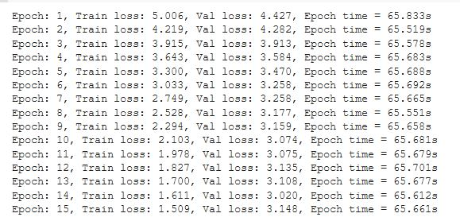

***
## Re-writing Repo 

**[Source Repo](https://github.com/bentrevett/pytorch-seq2seq)**


[Solution Colab link : code 2 - Learning Phrase Representations using RNN Encoder-Decoder for Statistical Machine Translation](https://colab.research.google.com/drive/1YlZ3ptpgDZHiAeJmPE-PWAqimfbHhJb2?usp=sharing)


[Solution Colab link : code 3 - Neural Machine Translation by Jointly Learning to Align and Translate]


### 1. To create Tokens

```
from torchtext.data.utils import get_tokenizer

SRC_LANGUAGE = 'de'
TGT_LANGUAGE = 'en'

# Place-holders
token_transform = {}
vocab_transform = {}

token_transform[SRC_LANGUAGE] = get_tokenizer('spacy', language='de')
token_transform[TGT_LANGUAGE] = get_tokenizer('spacy', language='en')
```

**Example :**

```
token_transform[TGT_LANGUAGE]('This is my notebook')
```
['This', 'is', 'my', 'notebook']


### 2. Build Vocabulary

Takes in an iterator and returns list of tokens

```
def yield_tokens(data_iter: Iterable, language: str) -> List[str]:
    language_index = {SRC_LANGUAGE: 0, TGT_LANGUAGE: 1}

    for data_sample in data_iter:
        yield token_transform[language](data_sample[language_index[language]])
```

Define special symbols to be used to track start, end of sentence, pad and unknowns.

```
UNK_IDX, PAD_IDX, BOS_IDX, EOS_IDX = 0, 1, 2, 3
# Make sure the tokens are in order of their indices to properly insert them in vocab
special_symbols = ['<unk>', '<pad>', '<bos>', '<eos>']
```

Run in a loop twice to build vocab for source and target language

```
for ln in [SRC_LANGUAGE, TGT_LANGUAGE]:
  # Training data Iterator 
  train_iter = Multi30k(split='train', language_pair=(SRC_LANGUAGE, TGT_LANGUAGE))
  # Create torchtext's Vocab object 
  vocab_transform[ln] = build_vocab_from_iterator(yield_tokens(train_iter, ln),
                                                    min_freq=1,
                                                    specials=special_symbols,
                                                    special_first=True)
```

*NOTE* : train_iter must be inside the loop so that it is not exhausted


Use *set_default_index* to set the default index to be used when token is not found.

```
for ln in [SRC_LANGUAGE, TGT_LANGUAGE]:
  vocab_transform[ln].set_default_index(UNK_IDX)
```

**Example :**

```
vocab_transform[TGT_LANGUAGE](['this', 'is'])
```
[595, 11]


```
vocab_transform[SRC_LANGUAGE](['es', 'de'])
```
[302, 7281]

### 3. Add prefix BOS and post fix EOS for input indices

This function adds BOS and EOS and creates tensor to the input list.

```
def tensor_transform(token_ids: List[int]):
    return torch.cat((torch.tensor([BOS_IDX]), 
                      torch.tensor(token_ids), 
                      torch.tensor([EOS_IDX])))
```

**Example :**

```
tensor_transform(vocab_transform[TGT_LANGUAGE](['Two', 'young', ',', 'White', 'males', 'are', 'outside', 'near', 'many', 'bushes', '.', '\n']))
```
tensor([   2,   20,   26,   16, 1170,  809,   18,   58,   85,  337, 1340,    6,
           5,    3])
		   
### 4. Collate function


```
from torch.nn.utils.rnn import pad_sequence

def collate_fn(batch):
    tgt_batch, src_batch = [], []
    for _src, _tgt in batch:
      _tgt = token_transform[TGT_LANGUAGE](_tgt)
      _src = token_transform[SRC_LANGUAGE](_src)

      _tgt_tok = vocab_transform[TGT_LANGUAGE](_tgt)
      _src_tok = vocab_transform[SRC_LANGUAGE](_src)

      _tgt_tok_app = tensor_transform(_tgt_tok)
      _src_tok_app = tensor_transform(_src_tok)

      tgt_batch.append(_tgt_tok_app)
      src_batch.append(_src_tok_app)

    src_batch = pad_sequence(src_batch, padding_value=PAD_IDX)
    tgt_batch = pad_sequence(tgt_batch, padding_value=PAD_IDX)

    return src_batch, tgt_batch

```

### Inference

```
model.eval()
losses = 0

val_iter = Multi30k(split='valid', language_pair=(SRC_LANGUAGE, TGT_LANGUAGE))
val_dataloader = DataLoader(val_iter, batch_size=BATCH_SIZE, collate_fn=collate_fn)

for src, tgt in val_dataloader:
  src = src.to(device)
  tgt = tgt.to(device)

  output = model(src, tgt)
  output = output[1:]
  tgt = tgt[1:]

  v = output.argmax(2)

  for k in range(10):
    j = random.randint(0,BATCH_SIZE-1)

    result = vocab_transform[TGT_LANGUAGE].lookup_tokens(v[:,j].tolist())
    sourcetxt = vocab_transform[SRC_LANGUAGE].lookup_tokens(src[1:,j].tolist())
    acttgt = vocab_transform[TGT_LANGUAGE].lookup_tokens(tgt[:,j].tolist())

    print('Input Text: ', create_sentence(sourcetxt).rstrip('\n'))
    print('Predicted Text  : ', create_sentence(result).rstrip('\n'))
    print('Actual Output Text: ', create_sentence(acttgt).rstrip('\n'))
    print('*'*40)

  break
```

### Train Logs



### 10 Sample Results

```
Input Text:  Baby sieht sich die Blätter am Zweig eines Baumes an . 
Predicted Text  :  Baby looking at the top at a tree . 
Actual Output Text:  Baby looking at the leaves on a branch of a tree . 
****************************************
Input Text:  Eine Person in einem roten <unk> liegt auf sehr <unk> Art auf einer Mauer vor einem Laternenpfahl . 
Predicted Text  :  A person in a red - is lying on a a on a a of of a of a . . . a . 
Actual Output Text:  A person wearing a red long - sleeved shirt is lying down on a wall in front of a lamp post in a very unusual manner . 
****************************************
Input Text:  Bauarbeiter stehen auf einer Maschine 
Predicted Text  :  Construction workers standing on a of a machine . 
Actual Output Text:  Construction workers standing on top of a piece of machinery . 
****************************************
Input Text:  Ein asiatisches Mädchen mit grünem Hut und Schürze serviert Getränke auf einem Tablett . 
Predicted Text  :  An older girl in a green hat and blue hat is a a a . . 
Actual Output Text:  An Asian girl in a green hat and apron is serving drinks on a tray . 
****************************************
Input Text:  Eine junge Frau und eine ältere Frau in traditionellen Saris spinnen Textilien , während drei weitere Personen in moderner Kleidung nur von der Taille abwärts auf dem Bild zu sehen sind . 
Predicted Text  :  A lady lady and a lady in traditional clothing , the are the are the older man the while the the in . 
Actual Output Text:  A young woman and older woman wear traditional saris as they spin textiles , three people are pictured at only the <unk> , and wear modern clothes . 
****************************************
Input Text:  Der <unk> hört dem Arbeiter mit dem grünen Schutzhelm zu , während die zu <unk> Ausrüstung <unk> wird . 
Predicted Text  :  The green rock gets to the the to the green shirt hat . he . . 
 . . moved . 
Actual Output Text:  The FedEx driver listens to the workman in the green hard hat while the equipment to ship is being loaded . 
****************************************
Input Text:  Ein Hund geht mit einem Tuch im Maul durch einen kleinen Bach . 
Predicted Text  :  A dog walks with a small with a a stick in its mouth . 
Actual Output Text:  A dog walking through a small stream with a rag in his mouth . 
****************************************
Input Text:  Ein Kind macht einen Rückwärtssalto , während es auf einem Trampolin hüpft . 
Predicted Text  :  A child does doing a flip flip while doing a toy toy . 
Actual Output Text:  A child is doing a back flip whilst jumping on a trampoline . 
****************************************
Input Text:  Ein junges Mädchen läuft allein durch einen Park . 
Predicted Text  :  A young girl running through a . 
 park . 
Actual Output Text:  A young girl running by herself in a park . 
****************************************
Input Text:  <unk> blicken auf ein Herz , das von einem <unk> am Himmel <unk> wurde . 
Predicted Text  :  A team at at a a a in the in a a field . . 
Actual Output Text:  Beach goers look at a heart left in the sky by a sky writer . 
****************************************
```