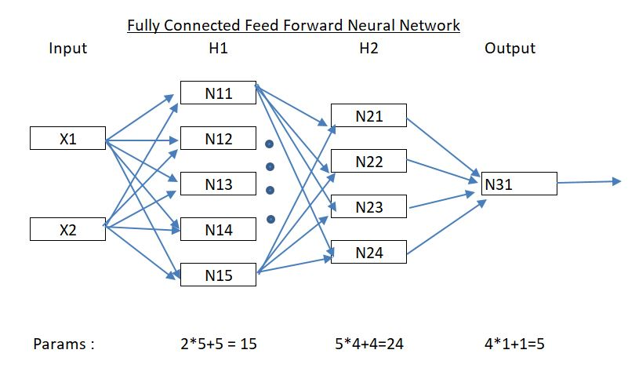
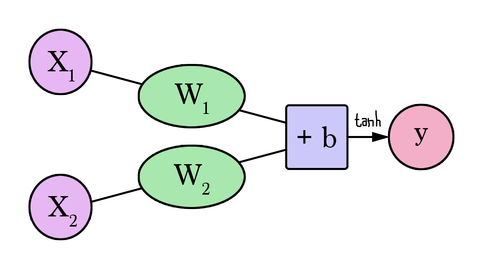
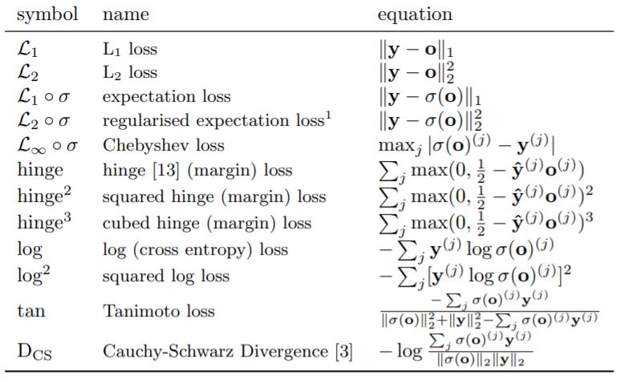

#### Session 1 
***
## Example of Feed forward Deep Neural Network 

Quest 		: Create a feed forward DNN with 44 parameters

Solution 	: Full code can be found in END2_Session1.ipynb colab file above

***
## 1. Understanding "a neural network neuron"

A neural network neuron is similar to our brain neuron but not same ( brain neuron can store as well as compute but neural network neuron can just store temporary data )
A neural network neuron has input connections ( similar to brain neuron has dentrides ) and output connections ( similar to axon ).

It is basic building block for neural network. One or more neuron stack up to form a hidden layer. 
A neural network can have one or more hidden layers.

#### A neural network with two inputs and a single neuron looks like -

Here x1 and x2 are two inputs and while training the neural network we try to optimise w1 & w2 weights associated with incoming connections (plus a bias b, similar to intercept in ML).

Output 

y = tanh ( w1 * x1 + w2 * x2 + b )

tanh is the activation function. Other examples of activation functions are sigmoid, ReLU,  Leaky ReLU etc.

#### Why activation function?
In the absence of activation function output y could result in any value between -inf to +inf and when we have multiple hidden layers this may explode. 
So we use activation functions as bounding the output upstream say in [0,1]

https://jalammar.github.io/visual-interactive-guide-basics-neural-networks/

***
## 2. Understanding "Learning rate"

While training any neural network we use a configurable hyperparameter "Learning rate". 
This learning rate is the step size determining the extend of change in weights in hidden layers in each iteration ( backpropagation ) during training.

Very high values of learning rate fails the network to converge to minima thus yielding larger errors on each iteration.

***
## 3. Understanding "weights initialization"

Weights initialization for all connections in neural network is crucial. It provides a starting point prior to training NN.

We shouldn't initialize all weights to ZERO, if we do so during the training ( backpropagation ) weights will not be updated to any +ve or -ve nos as partial derivative will also result in ZERO values
( assuming bias are zero).
Similarly initializing with same constant value for all weights will also result in poor results. As neurons will evolve same when trained ( assuming bias zero).

Initializing weights to too large value or too low value leads to divergence (exploding gradients) or 
slow learning (vanishing gradients) respectively.

#### Strategies for initialization

1. Random values : Pick randomly from normal distribution for each layer.
2. Xavier initialization
3. He Weight initialization

Read here - https://www.deeplearning.ai/ai-notes/initialization/

***
## 4. Understanding "Loss" in neural network

We build NN model to perform a task ( classification, regression, combination of both ). We start by designing/ deciding NN architecture and parameters, 
These parameters decide how well the NN will perform on training, test data or field data.
While training, there must be some comparison between actual truth and oberserved output from final NN output which needs to feed back ( done by back propagation)
for weight updates ( optimization). 
Thus we need to oberve difference from actual truth to oberserved output from NN. This measure of difference is called Loss. 

The value of loss helps in building trust for NN model developed.

Choosing a right loss function depends on problem which we are solving - determines model training and performance.

Read more  - https://www.deeplearning.ai/ai-notes/optimization/

***
## 5. Understanding "chain rule" in gradient flow
