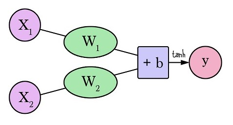
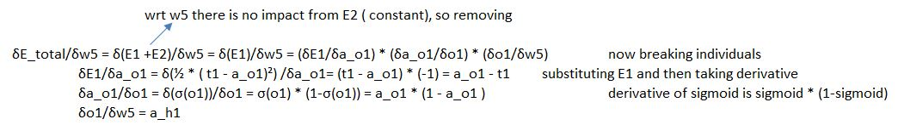

#### Session 1 
***
## Example of Feed forward Deep Neural Network 

Quest 		: Create a feed forward DNN with 44 parameters

Solution 	: Full code can be found in END2_Session1.ipynb colab file above

***
## 1. Understanding "a neural network neuron"

A neural network neuron is similar to our brain neuron but not same ( brain neuron can store as well as compute but neural network neuron act as memory or signal storage )
A neural network neuron has input connections ( similar to brain neuron has dentrides ) and output connections ( similar to axon ).

It is basic building block for neural network. One or more neuron stack up to form a hidden layer. 
A neural network can have one or more hidden layers.

#### A neural network with two inputs and a single neuron looks like -

Here x1 and x2 are two inputs and while training the neural network we try to optimise w1 & w2 weights associated with incoming connections (plus a bias b, similar to intercept in ML).

** Output **

y = tanh ( w1 * x1 + w2 * x2 + b )

tanh is the activation function. Other examples of activation functions are sigmoid, ReLU,  Leaky ReLU etc.

#### Why activation function?

In the absence of activation function output y will become just be a linear function. Even if we have 
multiple layers, each neuron-connections would collapse to one layer of big linear equation. The real worl problems
which we are trying to solve are not linear but complicated curves (or relationships).

[Read more](https://jalammar.github.io/visual-interactive-guide-basics-neural-networks/)

***
## 2. Understanding "Learning rate"

While training any neural network we use a configurable hyperparameter "Learning rate". 
This learning rate is the step size determining the extend of change in weights in hidden layers in each iteration ( backpropagation ) during training.

Very high values of learning rate fails the network to converge to minima thus yielding larger errors on each iteration.

Learning rate must not be fixed but can also be **time-based, step-based and exponential**

***
## 3. Understanding "weights initialization"

Weights initialization for all connections in neural network is crucial. It provides a starting point prior to training NN.

We shouldn't initialize all weights to ZERO, if we do so during the training ( backpropagation ) weights will not be updated to any +ve or -ve nos as partial derivative will also result in ZERO values
( assuming bias are zero).
Similarly initializing with same constant value for all weights will also result in poor results. As neurons will evolve same when trained ( assuming bias zero).

Initializing weights to too large value or too low value leads to divergence (exploding gradients) or 
slow learning (vanishing gradients) respectively.

#### Strategies for initialization

1. Random values : Pick randomly from normal distribution for each layer.
2. Xavier initialization
3. He Weight initialization

[Read more](https://www.deeplearning.ai/ai-notes/initialization/)

***
## 4. Understanding "Loss" in neural network

We build NN model to perform a task ( classification, regression, combination of both ). We start by designing/ deciding NN architecture and parameters, 
These parameters decide how well the NN will perform on training, test data or field data.
While training, there must be some comparison between actual truth and oberserved output from final NN output which needs to feed back ( done by back propagation)
for weight updates ( optimization). 
Thus we need to oberve difference from actual truth to oberserved output from NN. This measure of difference is called Loss. 

The value of loss helps in building trust for NN model developed.

Choosing a right loss function depends on problem which we are solving - determines model training and performance.

[Read more](https://www.deeplearning.ai/ai-notes/optimization/)

***
## 5. Understanding "chain rule" in gradient flow

During DNN training we have weights param for each of the connections ( in - out from neurons ) and we have
loss function defined and computed, post one forward pass. Next with each iteration we have to update the weights in order to reduc the loss further ( minimise the 
loss)

So during the backpropagation, we compute partial derivative of the loss function 
with respect to the weights of the output layer (dE_total/dW5) and then the hidden layer 
(dE_total/dw1). 

Example : Assume below is the NN and weights ( assume no bias ).

Then we can apply chain rule to determine the delta change in weights of network by just expanding the 
partial derivatives as shown below.

* Additional notes : Activation Functions *
 
It also performs a nonlinear transformation on the input to get better results on a complex neural network.
Activation function also helps to normalize the output of any input in the range between 1 to -1. Thus reduce the computation time because the neural network sometimes trained on millions of data points.

The sigmoid function causes a problem mainly termed as vanishing gradient problem which occurs because we convert large input in between the range of 0 to 1 and therefore their derivatives become much smaller which does not give satisfactory output.
