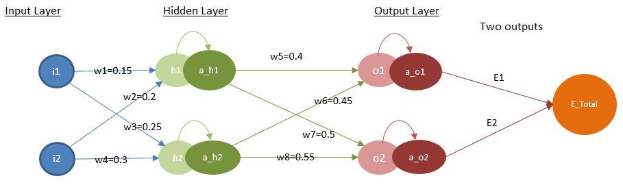
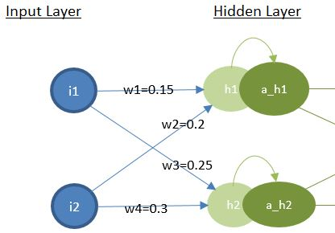
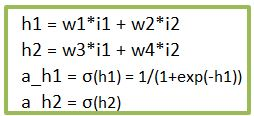
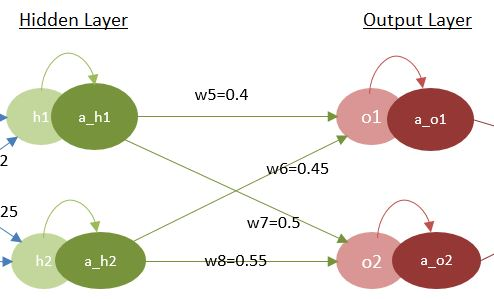
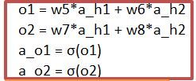
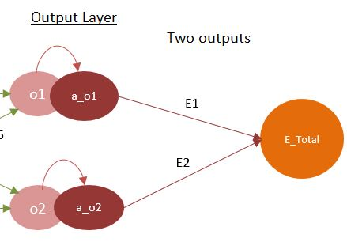
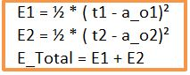
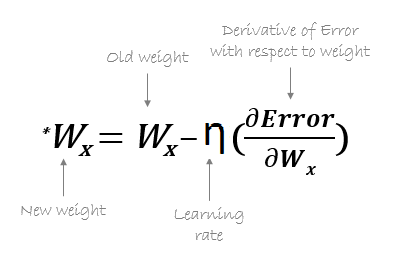

#### Session 2
***
## 🏋️‍♀️ Backpropagation in Excel 🤽‍♀️🏟

**Objective**

To understand backpropagation and chain rule in Neural Networks

Let's follow the below NN architecture -

Here we have **2 inputs (i1 & i2), one hidden layer (in green) and one output layer ( in maroon)**.

All connections are labelled and assigned with intial weights as shown in figure above.
> Assume there are no bias terms, just for the sake of understanding backprop.

Assume,
> Learning rate η= 0.5 

Assume below are *true expected outputs t1 & t2. i1 & i2 are inpt values.*
> Just for understanding purpose we will use same inputs and same outputs 

| Output t1       | Output t2     | i1     | i2     |
| :-------------- | :-----------: | -----: |------: |
|  0.01           | 0.99          | 0.05   | 0.1    | 

**Light and dark color circles (green/ maroon) are neurons without activation and with activation repectively.** 
Here for simplicity we are using sigmoid function as activation function.

Now from basics of neural network we can write below equations,

For hidden layer ( incoming connections w1, w2, w3 & w4 and inputs i1 & i2 ) -

  

For output layer ( incoming connections w5, w6, w7 & w8 ) - 

 

As we have two outputs ( assuming T1 and T2 as actual truth outputs), there will be errors in both, 
lets call E1 & E2. Hence -

 

With above basic equations in hand we need to update the all weights in each iteration in such a way that
**will minimize the error E_total** via backpropagation.

In next subsequent steps we will see Change in **δE_total wrt δwx ( here x = 1,2,3....8; denoting w1, w2, ...w8)**

**δE_total/δw5**
> δE_total/δw5 = δ(E1 +E2)/δw5

*Because wrt w5 there is no impact from E2 ( constant), so removing and later applying chain ruleand expanding.*

> δ(E1 +E2)/δw5 = δ(E1)/δw5 = (δE1/δa_o1) * (δa_o1/δo1) * (δo1/δw5)

*Computing separately*

>> δE1/δa_o1 = δ(½ * ( t1 - a_o1)²) /δa_o1= (t1 - a_o1) * (-1) = a_o1 - t1

*We substituted E1 = ½ * ( t1 - a_o1)² & then did partial derivative*

>> δa_o1/δo1 = δ(σ(o1))/δo1 = σ(o1) * (1-σ(o1)) = a_o1 * (1 - a_o1 )

*Substituted a_o1 = σ(o1) and took partial derivative of sigmoid*

>> δo1/δw5 = a_h1

*Substituted o1 = w5 * a_h1 + w6 * a_h2 and took derivative wrt δw5*

Finally,

**δE_total/δw5 = (a_o1 - t1 ) * a_o1 * (1 - a_o1 ) * a_h1**

By seeing above equation, we know that δE_total/δw5 depends on a_o1, t1, and a_h1. 
In similar way we can also write for w6 (as w6 is taking input from a_h2 )

> δE_total/δw6 = (a_o1 - t1 ) * a_o1 * (1 - a_o1 ) * **a_h2**

Similarly for w7, 

> δE_total/δw7 = (a_o2 - t2 ) * a_o2 * (1 - a_o2 ) * a_h1

and for w8,

> δE_total/δw8 = (a_o2 - t2 ) * a_o2 * (1 - a_o2 ) * a_h2

* Additional notes : Activation Functions *
 
It also performs a nonlinear transformation on the input to get better results on a complex neural network.
Activation function also helps to normalize the output of any input in the range between 1 to -1. Thus reduce the computation time because the neural network sometimes trained on millions of data points.

The sigmoid function causes a problem mainly termed as vanishing gradient problem which occurs because we convert large input in between the range of 0 to 1 and therefore their derivatives become much smaller which does not give satisfactory output.

