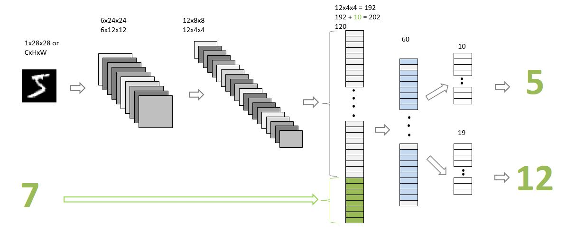

#### Session 1 
***
##Custom NN 
### 2 Inputs 
#### 1 image i/p from MNIST
#### 1 random number 0-9

### 2 Output 
#### the "number" that was represented by the MNIST image ( Classification )
#### the "sum" of this number with the random number that was generated and sent as the input to the network

## Proposed Solution 

MNIST images shape 
It is a 4D tensor of shape(samples, channels, height, width). As MNIST images are grayscale image number of the channel will be 1.
C = 1
H=28
W=28
Batch = 100 ( we took here )

First i/p tensor [100,1,28,28] form image per batch
Second input is one-hot encoding for digits 0-9 
we randomly generated , ....
>
>   digits = torch.randint(0, 10, (batch_size,)) # batch_size rand ints
>   digits_one = F.one_hot(digits, num_classes=10) # one hot encoding
>

####must mention how you have combined the two inputs

####must mention how you are evaluating your results

####must mention "what" results you finally got and how did you evaluate your results

####must mention what loss function you picked and why!

####training MUST happen on the GPU

