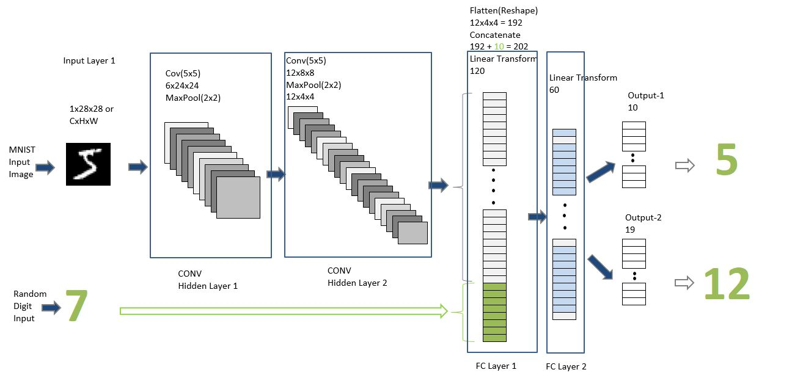
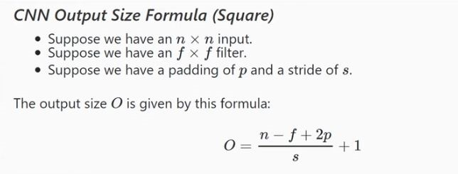
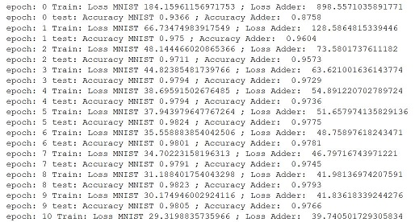
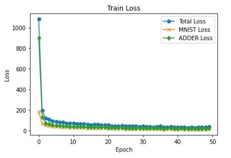
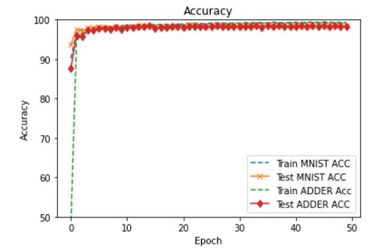
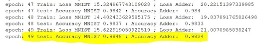
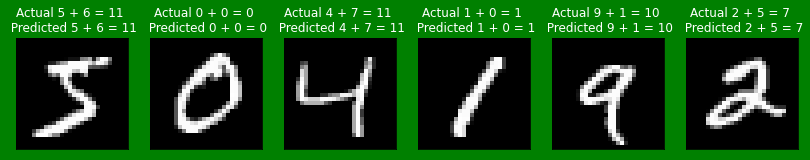
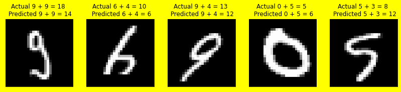
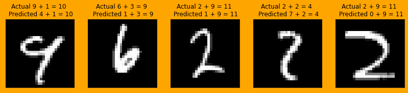
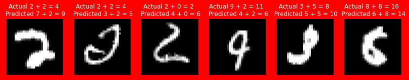

#### Session 3 
***
## 🦧 Custom NN Pytorch using GPU
### 2 Inputs :
##### - 1 image i/p from MNIST
##### - 1 random number (0-9)

### 2 Outputs :
##### - the "number" that was represented by the MNIST image ( Classification )
##### - the "sum" of MNIST number with the random number 🤐 that was generated and sent as the input to the network

## Proposed Solution 🙌
***

MNIST images shape is a 4D tensor of shape(samples, channels, height, width). As MNIST images are grayscale image number of the channel will be 1.

C = 1

H=28

W=28

Batch = 100 ( we took here )

**First i/p tensor** [100,1,28,28] from image per batch is fed to CONV Layer 1 

Flatten Output from CONV Layer 2
> 12x4x4 = 192

**Second input** is one-hot encoding for digits 0-9 
we randomly generated , ....

>   digits = torch.randint(0, 10, (batch_size,)) # batch_size rand ints

>   digits_one = F.one_hot(digits, num_classes=10) # one hot encoding

Adding 10 
> 192 + 10 = 202

You can see in network below -

#### Combine the two inputs

As you can see we have combined **random digit** input to **first FC Layer**. We do so by **concatenating 
the flattened output tensor from CONV Layer 2**

> t = torch.cat((t, d), dim=1)

#### Understanding CNN i/p (square) & o/p 

| Operation	    	| 	Output Shape  |
| ------------- 	| 	------------- |
| Input MNIST   	| 	[1,1,28,28]   |
| Conv 5x5		  	| 	[1,6,24,24]   |
| MaxPool 2x2	 	| 	[1,6,12,12]   |
| Conv 5x5		  	| 	[1,12,8, 8]	  |
| MaxPool 2x2	 	| 	[1,12,4, 4]   |
| Flatten(reshape) 	| 	[1, 192]	  |
| Concate(Input 2) 	| 	[1, 202]	  |
| FC 1(Linear trans)| 	[1, 120]	  |
| FC 2(Linear trans)| 	[1, 60] 	  |
| OP 1(Linear trans)| 	[1, 10] 	  |
| OP 2(Linear trans)| 	[1, 19] 	  |

#### Loss function
Losses in output layer is evaluated using **Cross Entropy** ( for both outputs )

> Output 1 : 10 unique classes (0-9)

> Output 2 : 19 unique classes (0-19, as min 0+0 = 0 & max 9+9=18 )

For muli-class ( say unique classes = 10 for 0-9 image classes )

**Loss is calculated using separately for each class (one class or rest all classes) label per observation and sum the result.**

*where,*

M : number of classes (0,1,2,3....9)

log : natural log

y : binary indicator (0 or 1) if class label c is the correct classification for observation o

p : predicted probability observation o is of class c

#### While Training 🤹‍♂️
We use above defined losses minimise and capture as we train for multiple epochs : understand where are losses more, when it becomes flat, when to stop/ needs fixes

##### Visualize Training Losses
**Loss in MNIST classification**

**Loss in Adder**

We see that with increase in epoch our model losses reduces and becomes nearly to flat.

We observe the **accuracy of test is at 98% for both MNIST classification and Adder** after 50 epochs.

#### Sample Outcomes :

**There could be 4 combinations** -

1. Correct Image Class & Correct Addition

2. Correct Image Class & **Wrong Addition**

3. **Wrong Image Class** & Correct Addition

4. **Wrong Image Class** & **Wrong Addition**

